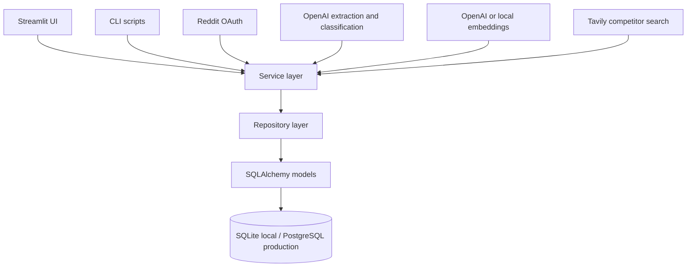

# FlowSift AI

FlowSift AI turns evidence from real online discussions into ranked, explainable startup opportunities. It collects problem statements, clusters related pain points, researches competitors, scores market gaps, and keeps every conclusion connected to its source evidence.

## Run FlowSift AI Now

Run commands from the repository root, the folder containing `streamlit_app.py`.

```bash
cd /path/to/flowsift-ai
bash scripts/run_app.sh
```

The launcher:

1. Uses `FLOWSIFT_PYTHON` when you explicitly provide one.
2. Uses `/opt/anaconda3/bin/python` on the Mac where this project was built.
3. Falls back to `python3` on other machines.
4. Creates `.env` from `.env.example` when needed.
5. Initializes the configured database safely.
6. Starts the Streamlit application.

Open [http://localhost:8501](http://localhost:8501) when the terminal prints the Local URL. Keep that terminal open while using FlowSift AI. Press `Control+C` in the terminal to stop the app.

The project-local `.venv` in the original macOS checkout was offloaded by macOS and can stall while importing packages. The launcher deliberately uses the working Anaconda Python on that machine. Do not activate that `.venv`.

To use another Python installation or another port:

```bash
FLOWSIFT_PYTHON=/path/to/python bash scripts/run_app.sh --server.port 8502
```

## What "Fully Live" Means

The web server can run without provider credentials, but real extraction, semantic clustering, web research, and Reddit collection require external API access.

FlowSift AI is fully live when the **Settings** page shows all four readiness badges as **Ready**:

- **Extraction:** OpenAI is configured.
- **Embeddings:** OpenAI embeddings or local Sentence Transformers are configured.
- **Research:** Tavily is configured.
- **Reddit:** approved Reddit OAuth credentials are configured.

An empty live database is normal. Opportunities appear only after FlowSift AI processes evidence.

## Fully Launch the Product

### 1. Obtain provider credentials

You need:

- An [OpenAI API key](https://platform.openai.com/api-keys) for structured problem extraction and competitor classification.
- A [Tavily API key](https://app.tavily.com) for web competitor research.
- An approved [Reddit developer application](https://developers.reddit.com/app-registration) with a client ID and client secret for Reddit collection.

Reddit may require application review or approval. Manual paste and CSV ingestion still work without Reddit after OpenAI is ready.

Never commit API keys. FlowSift AI stores locally entered credentials in the ignored `.env` file.

### 2. Start the application

```bash
bash scripts/run_app.sh
```

Then open [http://localhost:8501](http://localhost:8501).

### 3. Configure live mode in Settings

Open **Settings** in the left navigation and set:

| Setting | Live value |
| --- | --- |
| Environment | `production` |
| Demo mode | Off |
| LLM provider | `openai` |
| LLM model | `gpt-5.6-luna` |
| OpenAI API key | Your OpenAI API key |
| Embedding provider | `openai` |
| Embedding model | `text-embedding-3-small` |
| Search provider | `tavily` |
| Tavily API key | Your Tavily API key |
| Reddit client ID | Your approved OAuth client ID |
| Reddit client secret | Your approved OAuth client secret |
| Reddit user agent | A descriptive value naming FlowSift AI and its operator |

Leave the database as `sqlite:///flowsift_live.db` for a local live launch. Click **Save configuration**.

The default OpenAI model is the cost-sensitive GPT-5.6 variant. OpenAI embeddings use `text-embedding-3-small`, which is intended for tasks including clustering and similarity search.

### 4. Restart after changing configuration

Press `Control+C` in the terminal and launch again:

```bash
bash scripts/run_app.sh
```

The launcher initializes whichever database is named in `.env` before starting the server. Return to **Settings** and confirm every provider you intend to use says **Ready**.

### 5. Create the first real opportunity

1. Open **Discover**.
2. Choose **Paste discussion**.
3. Paste a genuine first-person complaint or workflow description. Concrete evidence works best, such as time lost, repetitive work, expensive software, missed revenue, spreadsheet workarounds, or requests for a better tool.
4. Optionally add the title, source URL, author, and community. Source metadata improves traceability and confidence.
5. Click **Extract and score**.
6. Review whether the evidence was accepted or rejected in **Extraction review**.
7. Open **Opportunities** to see the resulting cluster and scores.
8. Open the opportunity, then click **Research competitors** to run Tavily search and OpenAI classification.
9. Inspect **Evidence**, **Competitors**, and **Scoring** before treating the opportunity as validated.

## How to Use Every Page

### Overview

Use **Overview** for the operating snapshot:

- Evidence item count
- Opportunity cluster count
- Researched opportunity count
- Research coverage
- Highest-ranked opportunities
- Recent ingestion activity

Click an opportunity title to open its full details.

### Discover

Use **Discover** to add source evidence.

**Paste discussion** processes one source at a time. Include source metadata whenever it is available.

**Reddit** supports:

- A Reddit post URL
- A subreddit name
- Keyword search with an optional subreddit filter

Reddit collection is capped at 100 items per request. Collection requires approved Reddit OAuth credentials and should comply with Reddit's policies.

**Upload CSV** processes a bounded batch. The CSV must contain one of these text columns:

```text
raw_text
text
body
discussion
content
```

Optional columns include `source_url`, `title`, `source_author`, and `community`.

The **Extraction review** section separates accepted evidence from rejected text. Rejected text remains reviewable but is not clustered or scored.

### Opportunities

Use **Opportunities** to compare and prioritize clusters. You can:

- Filter by status, target customer, pain type, research state, and minimum scores.
- Sort by opportunity, problem, white-space, confidence, evidence count, or update time.
- Change rows per page.
- Open any opportunity for evidence and competitor inspection.

Treat **Opportunity Score** and **Confidence Score** separately. A promising score with low confidence means more independent evidence is needed.

### Opportunity Details

Use **Opportunity Details** to validate and correct one cluster.

- **Recompute scores** recalculates scores from stored evidence and competitor data.
- **Research competitors** runs live Tavily searches and classifies results with OpenAI.
- **Overview** summarizes the customer, problem, workaround, and proposed solution.
- **Evidence** shows source text and attribution.
- **Competitors** separates direct, adjacent, substitute, and irrelevant results.
- **Scoring** explains each score component.
- **Corrections** lets you correct customer labels, evidence fields, and competitor relationships, or merge and split clusters.
- **History** shows stored search queries and the correction audit trail.

Corrections are recorded as feedback instead of silently overwriting the history.

### Settings

Use **Settings** to:

- See database and provider readiness.
- Switch between demo and live mode.
- Save provider credentials locally.
- Select OpenAI, embedding, and search models.
- Change the database URL and scoring thresholds.
- Clear cached views after an external database change.

Password fields never display stored keys. Leaving a password field blank preserves its existing value unless the corresponding **Clear stored** checkbox is selected.

## Demo Mode

Demo mode is useful for learning the complete workflow without external API costs. Set `DEMO_MODE=true` in `.env`, then run:

```bash
/opt/anaconda3/bin/python scripts/initialize_database.py
/opt/anaconda3/bin/python scripts/seed_demo_data.py
bash scripts/run_app.sh
```

The seed script is safe to run repeatedly and avoids duplicate demo evidence and competitors.

To return to the live product, open **Settings**, turn **Demo mode** off, restore `sqlite:///flowsift_live.db`, save, and restart the launcher.

## First-Time Installation on Another Machine

Requirements: Python 3.11 or newer and network access for package installation.

Create the virtual environment outside cloud-synced folders so macOS does not offload package files:

```bash
python3.11 -m venv ~/.virtualenvs/flowsift
source ~/.virtualenvs/flowsift/bin/activate
python -m pip install --upgrade pip
python -m pip install -r requirements.txt
cp .env.example .env
FLOWSIFT_PYTHON="$HOME/.virtualenvs/flowsift/bin/python" bash scripts/run_app.sh
```

## Daily Start and Stop

Start:

```bash
cd /path/to/flowsift-ai
bash scripts/run_app.sh
```

Stop: press `Control+C` in the terminal running Streamlit.

Restart after code or environment changes: stop the process, then run `bash scripts/run_app.sh` again.

## Troubleshooting

### The command prints nothing

Do not use the offloaded project `.venv`. Press `Control+C`, then run:

```bash
bash scripts/run_app.sh
```

The launcher should print the initialized database, selected Python path, and Streamlit Local URL.

### Port 8501 is already in use

The app may already be running. Open [http://localhost:8501](http://localhost:8501), or start another instance:

```bash
bash scripts/run_app.sh --server.port 8502
```

Then open [http://localhost:8502](http://localhost:8502).

### The app opens but has no opportunities

Live databases begin empty. Configure OpenAI, submit evidence through **Discover**, and then open **Opportunities**. Demo records are loaded only by `scripts/seed_demo_data.py`.

### Discover or Research buttons are disabled

Open **Settings** and inspect the readiness badges:

- Discover requires extraction and embeddings.
- Competitor research requires extraction and search.
- Reddit collection additionally requires Reddit OAuth.

### A provider says Setup required

Confirm the provider is selected and its key is saved. Restart the app after changing `.env`. FlowSift AI checks whether credentials are configured; the first real request also verifies whether the provider accepts them.

### Check whether the server is healthy

```bash
curl http://localhost:8501/_stcore/health
```

A healthy server returns `ok`.

## Scoring

FlowSift AI stores versioned score records with structured explanations.

```text
Problem Score = 35% Pain Severity + 25% Problem Frequency
              + 20% Willingness to Pay + 20% Evidence Quality

White-Space Score = 30% Unmet Customer Need
                  + 25% Differentiation Potential
                  + 20% Competitor Weakness
                  + 15% Niche Specificity
                  + 10% Low Direct-Competitor Density

Opportunity Score = 25% Pain Severity + 15% Problem Frequency
                  + 15% Willingness to Pay + 10% Evidence Quality
                  + 15% White-Space + 10% Build Feasibility
                  + 10% Market Accessibility
```

Before competitor research, white-space is neutral. Missing search results are never treated as proof of an attractive market gap. Confidence is separate from opportunity quality and reflects evidence independence, extraction confidence, recency, agreement, and research coverage.

## Command-Line Operations

Ingest one discussion:

```bash
/opt/anaconda3/bin/python scripts/ingest_sources.py \
  --text "We still use Excel and this manual process takes hours every week."
```

Ingest and score a CSV:

```bash
/opt/anaconda3/bin/python scripts/ingest_sources.py --csv discussions.csv --max-rows 100
/opt/anaconda3/bin/python scripts/score_opportunities.py
```

Run tests:

```bash
/opt/anaconda3/bin/python -m pytest
```

Run database migrations:

```bash
/opt/anaconda3/bin/python -m alembic upgrade head
```

## Deployment

SQLite is appropriate for one local user. FlowSift AI initializes an empty database automatically on first UI access. A hosted production deployment should use PostgreSQL, execute Alembic migrations when upgrading an existing schema, and inject secrets through the hosting platform rather than `.env`.

```bash
docker build -t flowsift-ai .
```

See [Deployment](docs/DEPLOYMENT.md) for Docker, PostgreSQL, Streamlit Community Cloud, health checks, and rollback instructions.

## Architecture



## Data and Platform Safety

- Store API keys only in ignored `.env` files or managed secret stores.
- Preserve source attribution and collect only the text needed for the product workflow.
- Review each source platform's terms before commercial collection.
- Do not use FlowSift AI as an unrestricted scraper.
- Do not assume that no competitors found means a market is attractive.

## Current Limitations

- Reddit access depends on Reddit approving the intended data use and credentials.
- SQLite is local and single-instance; hosted deployments need persistent PostgreSQL.
- Build feasibility and market accessibility remain neutral until dedicated validation inputs are added.
- Streamlit read caches are process-local with a 30-second TTL.
- Tavily is the only live web search adapter currently implemented.

## Test Coverage

The suite covers persistence, ingestion validation, OpenAI structured output and retry behavior, Reddit normalization, extraction failures, clustering, competitor classification, researched white-space, confidence, corrections, merge and split behavior, audit history, and score recomputation.
