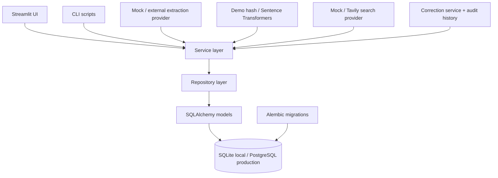

# InSift

InSift is a production-minded MVP for discovering evidence-backed startup opportunities from online discussions. It is designed to connect every opportunity to real user pain, cluster similar problems, research competitors, and rank opportunities with explainable scores.

This repository implements Phases 1-7: the project foundation, ingestion, evidence-grounded extraction, semantic clustering, competitor research, researched white-space scoring, ranked opportunities, and auditable user corrections.

## Screenshots

Placeholder: add screenshots after running the Streamlit app with seeded demo data.

## Main Features

- Typed settings loaded from environment variables or `.env`
- Structured JSON logging without API key leakage
- SQLAlchemy models for evidence, clusters, competitors, scores, and user feedback
- SQLite local development database with PostgreSQL-ready configuration
- Alembic migration support
- Repository layer for database persistence
- Deterministic demo seed data
- Manual pasted-text and CSV ingestion with duplicate protection
- Deterministic evidence pre-filter and structured extraction provider interface
- Offline mock extraction that works without an API key
- Deterministic demo embeddings and optional local Sentence Transformers embeddings
- Incremental cosine-similarity clustering with recomputed centroids
- Evidence-backed cluster summaries with source and author independence counts
- Explainable Problem, Opportunity, and Confidence scores
- Broad competitor-query generation with every query stored for auditability
- Tavily search integration with bounded retries and deterministic mock search
- Direct, adjacent, substitute, and irrelevant relationship classification
- Deduplicated competitor persistence with source snippets and reasoning
- Five-component White-Space Score based on need, differentiation, weaknesses, niche, and density
- Evidence, customer, and competitor corrections with feedback history
- Cluster merge and split workflows with automatic score recomputation
- Ranked and filterable Streamlit opportunity views with evidence drill-down
- Pytest coverage for ingestion, extraction, clustering, scoring, and persistence

## Architecture



## Data Pipeline

```text
Online discussions
        ↓
Evidence filtering
        ↓
Structured problem extraction
        ↓
Semantic clustering
        ↓
Opportunity generation
        ↓
Competitor research
        ↓
White-space analysis
        ↓
Explainable scoring
        ↓
Ranked opportunity dashboard
```

## Scoring Methodology

Scores are stored as versioned `OpportunityScore` records with structured explanations. Phases 4 and 6 calculate:

- Problem Score from pain severity, frequency, willingness to pay, and evidence quality
- White-Space Score from unmet need, differentiation, competitor weakness, niche specificity, and direct-competitor density
- Opportunity Score from problem strength, white-space, feasibility, and accessibility
- Confidence Score from source independence, extraction confidence, recency, agreement among sources, and available research coverage

```text
Problem Score = 35% Pain Severity + 25% Problem Frequency
              + 20% Willingness to Pay + 20% Evidence Quality

Opportunity Score = 25% Pain Severity + 15% Problem Frequency
                  + 15% Willingness to Pay + 10% Evidence Quality
                  + 15% White-Space + 10% Build Feasibility
                  + 10% Market Accessibility
```

Before research, white-space is neutral and explicitly labeled. After research, its five components are calculated from stored evidence, queries, competitor weaknesses, and supported gaps. Missing competitor results are never automatically rewarded. Build feasibility and market accessibility remain neutral pending dedicated validation.

```text
White-Space Score = 30% Unmet Customer Need
                  + 25% Differentiation Potential
                  + 20% Competitor Weakness
                  + 15% Niche Specificity
                  + 10% Low Direct-Competitor Density
```

The confidence score is intentionally separate from the opportunity score. A cluster may look promising while still having limited evidence.

## Setup

```bash
python -m venv .venv
source .venv/bin/activate
pip install -r requirements.txt
cp .env.example .env
python scripts/initialize_database.py
python scripts/seed_demo_data.py
streamlit run streamlit_app.py
```

## Environment Variables

```text
APP_ENV=development
DATABASE_URL=sqlite:///insift.db
LLM_PROVIDER=
LLM_API_KEY=
EMBEDDING_PROVIDER=sentence_transformers
EMBEDDING_MODEL=all-MiniLM-L6-v2
SEARCH_PROVIDER=
SEARCH_API_KEY=
SEARCH_DEPTH=basic
CLUSTER_SIMILARITY_THRESHOLD=0.78
MINIMUM_EXTRACTION_CONFIDENCE=0.45
MAX_SEARCH_RESULTS=10
DEMO_MODE=true
```

API keys should be stored in `.env` or deployment secrets. Do not commit them.

## Demo Mode

Demo mode is enabled by default. It uses deterministic extraction, embeddings, search results, and classification. The seed script inserts evidence, clusters, research queries, competitors, researched score breakdowns, and correction-ready records so the complete Phase 1-7 workflow can be explored without paid APIs.

```bash
python scripts/initialize_database.py
python scripts/seed_demo_data.py
streamlit run streamlit_app.py
```

The seed script is safe to run repeatedly; it avoids duplicating demo evidence and competitors.

To ingest one discussion from the command line:

```bash
python scripts/ingest_sources.py --text "We still use Excel and this manual process takes hours every week."
```

To ingest a CSV, include one of `raw_text`, `text`, `body`, `discussion`, or `content` as a column:

```bash
python scripts/ingest_sources.py --csv discussions.csv --max-rows 100
python scripts/score_opportunities.py
```

## Testing

```bash
pytest
```

Tests cover persistence, ingestion validation, extraction failures, clustering boundaries, query generation, competitor classification and deduplication, researched white-space, confidence, corrections, merge/split behavior, audit history, and score recomputation.

## Database Migrations

```bash
alembic upgrade head
```

For local development, `python scripts/initialize_database.py` can create tables directly from SQLAlchemy metadata. Production-style deployments should prefer Alembic migrations.

## Known Limitations

- A real hosted LLM provider is not wired yet; Phase 2 currently exposes the provider interface and deterministic demo implementation.
- Reddit URL and API ingestion are not implemented; manual and CSV ingestion are supported.
- The deterministic demo embedding is intentionally small. Non-demo mode can use the configured local Sentence Transformers model.
- Streamlit polish, pagination, caching, and deployment work remain in Phase 8.
- Merge operations archive the source cluster rather than deleting its historical scores and feedback.
- Real search currently supports Tavily; Brave Search remains a future provider adapter.

## Platform Data-Use Warning

Do not build or operate InSift as an unrestricted Reddit scraper. Review each platform's terms before commercial use. The MVP should preserve source attribution, collect only necessary text, use formally permitted API access where available, and avoid using collected content for model training.

## Future Roadmap

1. Improve Streamlit layout, pagination, caching, and loading states.
2. Add deployment documentation, screenshots, and production observability.
3. Add a hosted structured-output LLM provider and Brave Search adapter.
4. Add richer feasibility and market-access validation inputs.
